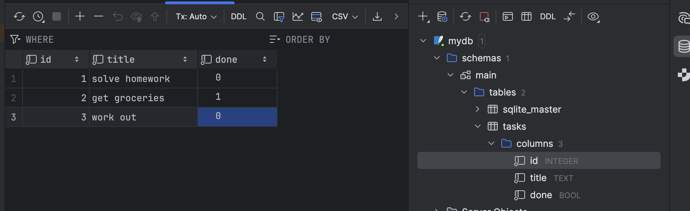

# Assignment 2 — Task API (FastAPI + SQLite)

A simple CRUD API for managing tasks, built with **FastAPI** and a **SQLite** database.

## Why SQLite

SQLite was chosen because this project is a small, single-user assignment rather than a production system with concurrent users. SQLite needs no separate database server to install or configure — it's just a single file on disk, which makes the project easy to set up, run, and grade without any extra infrastructure. For the scope of this assignment (a handful of CRUD endpoints backed by one `tasks` table), a full client-server database like PostgreSQL or MySQL would have added unnecessary setup overhead with no real benefit.

## Where the Database File Is Stored

The database is stored as a single file, **`mydb.db`**, in the root of the project directory (created automatically the first time the app runs, via `sqlite3.connect('mydb.db', ...)` in `db.py`). There's no separate database server — the file itself *is* the database.

## How to Start the Project

1. Clone the repository:
   ```bash
   git clone https://github.com/aat0ut/assignment2.git
   cd assignment2
   ```
2. Install the dependencies:
   ```bash
   pip install fastapi uvicorn
   ```
3. Run the API:
   ```bash
   uvicorn main:app --reload
   ```
4. The API will be available at `http://127.0.0.1:8000`. Interactive docs (Swagger UI) are available at `http://127.0.0.1:8000/docs`.

On first run, `main.py` automatically creates the `tasks` table (if it doesn't already exist) and seeds it with a few sample tasks.

## Database Viewer Screenshot



## Example SQL Query

Here's an example of a query executed against the `tasks` table (used internally by the `/tasks` endpoint):

```sql
SELECT * FROM tasks;
```

This returns all rows currently stored in the `tasks` table, e.g.:

| id | title           | done  |
|----|-----------------|-------|
| 1  | solve homework  | 0     |
| 2  | get groceries   | 1     |
| 3  | work out        | 0     |
